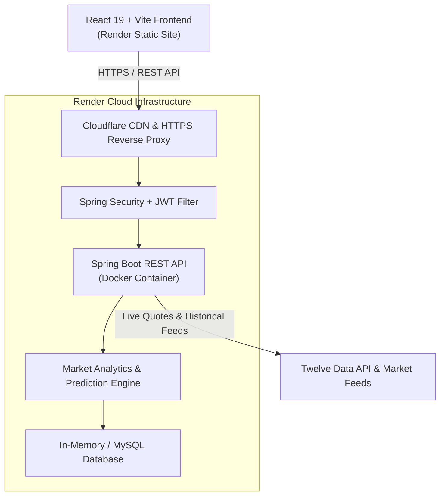

# 📈 StockAnalytics — Real-Time Market Prediction & Portfolio Intelligence

[](https://stock-market-frontend-rc3d.onrender.com/dashboard)
[](https://stock-market-backend-9ay5.onrender.com/)
[](https://react.dev/)
[](https://spring.io/projects/spring-boot)
[](https://www.docker.com/)

> A full-stack, enterprise-grade stock market analytics platform providing live equity quotes, multi-model AI price predictions (LSTM & XGBoost), FinBERT financial sentiment analysis, advanced technical indicators, and real-time portfolio management.

---

## 🌐 Live Deployments

| Component | Platform | Live URL |
| :--- | :--- | :--- |
| **Frontend Web App** | Render (Static Site) | **[https://stock-market-frontend-rc3d.onrender.com/dashboard](https://stock-market-frontend-rc3d.onrender.com/dashboard)** |
| **Backend REST API** | Render (Docker Service) | **[https://stock-market-backend-9ay5.onrender.com](https://stock-market-backend-9ay5.onrender.com)** |

---

## 💡 What This Application Does

**StockAnalytics** is designed for modern investors, quantitative analysts, and traders who need actionable market intelligence in one unified dashboard:

### 1. ⚡ Live Market Quotes & Continuous Ticker
* Tracks **91 global equities** across US Tech (Apple, Microsoft, Nvidia, Google, Tesla), Bluechips (JPMorgan, Walmart, Exxon), Indian Equities (Reliance, TCS, Infosys, HDFC Bank), and Cryptocurrencies (BTC, ETH).
* Features a real-time, smooth horizontal **Stock Ticker Tape** displaying live percentage changes and price fluctuations.
* Integrated with high-performance financial data feeds and the **Twelve Data API**.

### 2. 🧠 Multi-Model AI Stock Predictions
* **Predictive ML Benchmarking:** Compares predictive models (**LSTM Deep Learning**, **XGBoost Regressor**, and **Random Forest**) for target price estimation.
* **5-Day Price Trajectory:** Visualizes projected price path with confidence scores and clear market signals (**Bullish / Bearish / Neutral**).

### 3. 📰 FinBERT News Sentiment Analysis
* Natural Language Processing (NLP) tailored for finance to determine market sentiment.
* Scours latest headlines and calculates an aggregated **Sentiment Score** with visual distributions (**Positive / Neutral / Negative**).

### 4. 📊 Technical Indicators & Risk Analytics
* Computes real-time technical indicators:
  * **RSI (Relative Strength Index)** with Overbought / Oversold detection.
  * **MACD (Moving Average Convergence Divergence)** with signal line crossovers.
  * **Bollinger Bands** (Upper, Middle SMA, Lower).
  * **SMA & EMA** (20, 50, 200 periods).
* Quantitative risk metrics including **Sharpe Ratio**, **Beta**, **Annualized Volatility**, and **Maximum Drawdown**.

### 5. 💼 Portfolio & Holdings Tracker
* Real-time investment tracking with automatic weighted average buy price calculation.
* Live computation of **Total Portfolio Value**, **Unrealized Profit & Loss (P&L)**, and percentage returns based on real-time market quotes.
* Complete transactional audit trail for stock purchases and sales.

### 6. 🔐 Bank-Grade Security & Authentication
* Stateless **JWT (JSON Web Token)** authentication architecture.
* Passwords hashed using **BCrypt** with salted cryptography.
* Role-based and token-protected endpoints for portfolio and watchlist transactions.

---

## 🏗️ System Architecture



---

## 🛠️ Tech Stack

### Frontend:
* **Framework:** React 19, Vite
* **Routing:** React Router v7 (SPA client-side navigation)
* **Visualizations:** Recharts & TradingView Interactive Lightweight Charts
* **Styling:** Vanilla CSS with custom modern glassmorphic theme system (Dark/Light mode)
* **Icons:** Lucide React
* **HTTP Client:** Axios with JWT request/response interceptors

### Backend:
* **Language & Framework:** Java 17, Spring Boot 3
* **Security:** Spring Security, JJWT (io.jsonwebtoken)
* **Database & ORM:** Spring Data JPA, Hibernate, MySQL / H2
* **Build Tool:** Maven Wrapper (`mvnw`)
* **Containerization:** Multi-stage Docker (Eclipse Temurin 17 JRE)

---

## 🔌 API Endpoints Reference

### Authentication
* `POST /api/auth/register` — Register a new account (returns JWT token)
* `POST /api/auth/login` — Authenticate and receive JWT token

### Market & Stocks (Public)
* `GET /api/stocks` — Fetch all tracked global equities with live prices
* `GET /api/stocks/details/{symbol}` — Real-time quote and metadata for a specific ticker
* `GET /api/stocks/search?q={query}` — Search equities by ticker symbol or company name
* `GET /api/stocks/{symbol}/historical?timeframe=1M` — Historical price time-series for charting

### Analytics & AI Predictions (Public)
* `GET /api/analytics/indicators/{symbol}` — RSI, MACD, SMA, and Bollinger Bands
* `GET /api/analytics/risk/{symbol}` — Volatility, Sharpe Ratio, Beta, Max Drawdown
* `GET /api/predictions/{symbol}` — AI 5-day price trajectory and trend signal
* `GET /api/predictions/{symbol}/models` — Performance comparison of LSTM, XGBoost, and Random Forest
* `GET /api/sentiment/{symbol}` — FinBERT financial sentiment and news headlines

### Portfolio & Holdings (JWT Protected)
* `GET /api/portfolios` — Retrieve user's portfolio with live P&L and asset allocation
* `POST /api/portfolios/holdings` — Add a new stock holding
* `DELETE /api/portfolios/holdings/{id}` — Sell/remove a stock holding

---

## 💻 Local Development Setup

### Prerequisites
* **Java 17+** (JDK)
* **Node.js 18+** & npm
* **Git**

### 1. Clone the Repository
```bash
git clone https://github.com/vamshidhar-reddy890/stock-market-analytics.git
cd stock-market-analytics
```

### 2. Run the Backend
```bash
cd backend/spring-boot-project
./mvnw clean spring-boot:run
# Backend will start on http://localhost:9090
```

### 3. Run the Frontend
```bash
cd ../../frontend/react-project
npm install
npm run dev
# Frontend will start on http://localhost:5173
```

---

## 📄 License

This project is licensed under the MIT License — feel free to use and adapt it for learning or personal projects!
